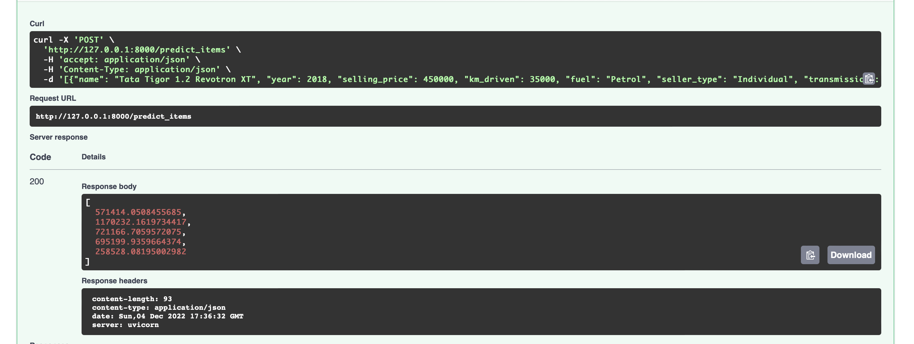

Результаты:
* Разведочный анализ. Рассмотрены основные описательные статистики вещественных и категориальных признаков.
Признаки mileage, engine, max_power и torque очищены от единиц измерения и приведены к вещественному типу, из
признака torque с помощью регулярных выражений извлечен признак max_torque_rpm. Визуальное
попарное распределение признаков и целевой переменной, корреляция между ними позволили выявить наличие связей, например,
между признаками max_power и engine.
* Построение моделей. Среди обычной линейной регрессии, ridge-регрессии и lasso-регрессии с различными 
гиперпараметрами лучше всего оказалась ridge-регрессия с параметром alpha=10. Наибольший буст в качестве дало 
добавление категориальных признаков.
* Бизнес метрика на тестовых данных у лучшей модели равна 19%.
* Сервис на FastAPI. Взаимодействие с сервисом реализовано через Swagger.
В шаблоне сервиса входные данные описаны как объекты типа json, поэтому без
frontend части сервиса не очень понятно как реализовать преобразование .csv
файла к json формату, не меняя формата входных данных. Исходя из этого,
на вход сервису через Swagger подавались данные в json формате. Примеры:
1. predict_item

В параметрах команды `curl` приведена одна из машин (из тестовых данных)
в json формате. Ее стоимость по предсказанию модели равна примерно 571414.
2. predict_items

Аналогично с прошлым пунктом на вход сервису поступают данные в json формате
по пяти машинам. Ответ модели приведен на последней картинке.
* Что не получилось сделать. Не успел более подробно изучить признаки
и применить feature engineering для улучшения качества модели.